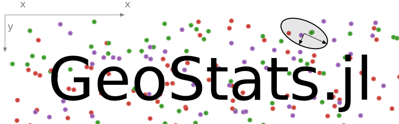
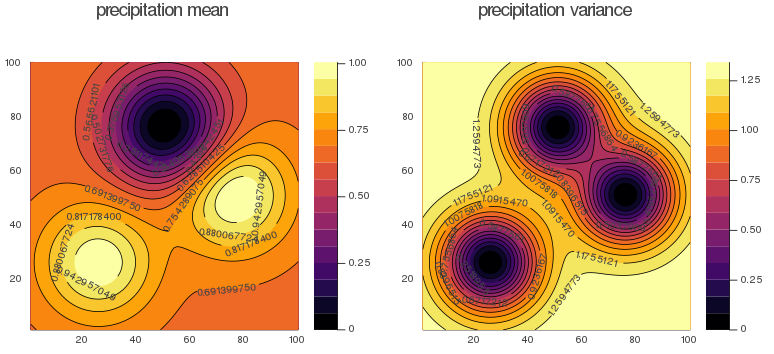

<p align="center">
  <br>
  <a href="https://travis-ci.org/juliohm/GeoStats.jl">
    
  </a>
  <a href="https://codecov.io/gh/juliohm/GeoStats.jl">
    
  </a>
  <a href="https://juliohm.github.io/GeoStats.jl/stable">
    
  </a>
  <a href="https://juliohm.github.io/GeoStats.jl/latest">
    
  </a>
  <a href="LICENSE">
    
  </a>
  <a href="https://gitter.im/JuliaEarth/GeoStats.jl">
    
  </a>
</p>
<p align="center">
  Cite as &#8599;
  <a href="https://doi.org/10.21105/joss.00692">
    
  </a>
  <a href="https://zenodo.org/badge/latestdoi/33827844">
    
  </a>
</p>

# Project goals

- Design a comprehensive framework for geostatistics (or spatial statistics) in a modern programming language.
- Address the lack of a platform for scientific comparison of different geostatistical algorithms in the literature.
- Exploit modern hardware aggressively, including GPUs and computer clusters.
- Educate people outside of the field about the existence of geostatistics.

### Related packages

- [GaussianProcesses.jl](https://github.com/STOR-i/GaussianProcesses.jl) &mdash; Gaussian processes
(the method) and Simple Kriging are essentially [two names for the same concept](https://en.wikipedia.org/wiki/Kriging).
The derivation of Kriging estimators, however; does **not** require distributional assumptions. It is a
beautiful coincidence that for multivariate Gaussian distributions, Simple Kriging gives the conditional
expectation. [Matheron](https://en.wikipedia.org/wiki/Georges_Matheron)
and other important geostatisticians have generalized Gaussian processes to more general random fields with
locally-varying mean and for situations where the mean is unknown. GeoStats.jl includes Gaussian processes as
a special case as well as other more practical Kriging variants, see the
[Gaussian processes example](https://github.com/juliohm/GeoStatsTutorials).

- [MLKernels.jl](https://github.com/trthatcher/MLKernels.jl) &mdash; Spatial structure can be
represented in many different forms: covariance, variogram, correlogram, etc. Variograms are more
general than covariance kernels according to the intrinsic stationary property. This means that
there are variogram models with no covariance counterpart. Furthermore, empirical variograms can be
easily estimated from the data (in various directions) with an efficient procedure. GeoStats.jl treats
variograms as first-class objects, see the
[Variogram modeling example](https://github.com/juliohm/GeoStatsTutorials).

- [Interpolations.jl](https://github.com/JuliaMath/Interpolations.jl) &mdash; Kriging and Spline interpolation
have different purposes, yet these two methods are sometimes listed as competing alternatives. Kriging estimation
is about minimizing variance (or estimation error), whereas Spline interpolation is about forcedly smooth estimators
derived for *computer visualization*. [Kriging is a generalization of Splines](http://www.sciencedirect.com/science/article/pii/009830048490030X)
in which one has the freedom to customize spatial structure based on data. Besides the estimate itself, Kriging
also provides the variance map as a function of knots configuration.

## Installation

Get the latest stable release with Julia's package manager:

```julia
] add GeoStats
```

## Project organization

The project is split into various packages:

| Package  | Description |
|:--------:| ----------- |
| [GeoStats.jl](https://github.com/juliohm/GeoStats.jl) | Main package containing Kriging-based solvers, and other geostatistical tools. |
| [GeoStatsImages.jl](https://github.com/juliohm/GeoStatsImages.jl) | Training images for multiple-point geostatistical simulation. |
| [GslibIO.jl](https://github.com/juliohm/GslibIO.jl) | Utilities to read/write *extended* GSLIB files. |
| [Variography.jl](https://github.com/juliohm/Variography.jl) | Variogram estimation and modeling, and related tools. |
| [KrigingEstimators.jl](https://github.com/juliohm/KrigingEstimators.jl) | High-performance implementations of Kriging estimators. |
| [GeoStatsBase.jl](https://github.com/juliohm/GeoStatsBase.jl) | Base package containing problem and solution specifications (for developers). |

The main package (i.e. GeoStats.jl) is self-contained, and provides high-performance
Kriging-based estimation/simulation algorithms over arbitrary domains. Other packages
can be installed from the list above for additional functionality.

### Problems and solvers

Solvers for geostatistical problems can be installed separately depending on the application.
They are automatically integrated with GeoStats.jl thanks to Julia's multiple dispatch features.

#### Estimation problems

| Solver | Description | Build | Coverage | References |
|:------:|-------------|-------|----------|------------|
| [Kriging](https://github.com/juliohm/KrigingEstimators.jl) | Kriging (SK, OK, UK, EDK) | [![][travis-img]][travis-url] | [![][codecov-img]][codecov-url] | [Matheron 1971](https://books.google.com/books/about/The_Theory_of_Regionalized_Variables_and.html?id=TGhGAAAAYAAJ) |
| [InvDistWeight](https://github.com/juliohm/InverseDistanceWeighting.jl) | Inverse distance weighting | [](https://travis-ci.org/juliohm/InverseDistanceWeighting.jl) | [](https://codecov.io/gh/juliohm/InverseDistanceWeighting.jl) | [Shepard 1968](https://dl.acm.org/citation.cfm?id=810616) |
| [LocalWeightRegress](https://github.com/juliohm/LocallyWeightedRegression.jl) | Locally weighted regression | [](https://travis-ci.org/juliohm/LocallyWeightedRegression.jl) | [](https://codecov.io/gh/juliohm/LocallyWeightedRegression.jl) | [Cleveland 1979](http://www.jstor.org/stable/2286407) |

#### Simulation problems

All simulation solvers can generate realizations in parallel unless otherwise noted.

| Solver | Description | Build | Coverage | References |
|:------:|-------------|-------|----------|------------|
| [DirectGaussSim](https://github.com/juliohm/DirectGaussianSimulation.jl) | Direct Gaussian simulation | [](https://travis-ci.org/juliohm/DirectGaussianSimulation.jl) | [](https://codecov.io/gh/juliohm/DirectGaussianSimulation.jl) | [Alabert 1987](https://link.springer.com/article/10.1007/BF00897191) |
| [SeqGaussSim](https://github.com/juliohm/KrigingEstimators.jl) | Sequential Gaussian simulation | [![][travis-img]][travis-url] | [![][codecov-img]][codecov-url] | [Gómez-Hernández 1993](https://link.springer.com/chapter/10.1007/978-94-011-1739-5_8) |
| [SpecGaussSim](https://github.com/juliohm/SpectralGaussianSimulation.jl) | Spectral Gaussian simulation | [](https://travis-ci.org/juliohm/SpectralGaussianSimulation.jl) | [](https://codecov.io/gh/juliohm/SpectralGaussianSimulation.jl) | [Gutjahr 1997](https://link.springer.com/article/10.1007/BF02769641) |
| [TuringPat](https://github.com/yurivish/TuringPatterns.jl) | Turing patterns | [](https://travis-ci.org/yurivish/TuringPatterns.jl) | [](https://codecov.io/gh/yurivish/TuringPatterns.jl) | [Turing 1952](https://royalsocietypublishing.org/doi/pdf/10.1098/rstb.1952.0012) |
| [ImgQuilt](https://github.com/juliohm/ImageQuilting.jl) | Fast image quilting | [](https://travis-ci.org/juliohm/ImageQuilting.jl) | [](https://codecov.io/gh/juliohm/ImageQuilting.jl) | [Hoffimann 2017](http://www.sciencedirect.com/science/article/pii/S0098300417301139) |
| [StratSim](https://github.com/juliohm/StratiGraphics.jl) | Stratigraphy simulation | [](https://travis-ci.org/juliohm/StratiGraphics.jl) | [](https://codecov.io/gh/juliohm/StratiGraphics.jl) | [Hoffimann 2018](https://searchworks.stanford.edu/view/12746435) |
| [CookieCutter](https://github.com/juliohm/GeoStatsBase.jl) | Cookie-cutter scheme | [![][travis-img]][travis-url] | [![][codecov-img]][codecov-url] | [Begg 1992](https://www.onepetro.org/conference-paper/SPE-24698-MS) |

If you are a developer and your solver is not listed above, please open a pull request and
we will be happy to review and add it to the list. Please check the developer guide in the
documentation below for instructions on how to write your own solvers.

## Documentation

- [**STABLE**][docs-stable-url] &mdash; **most recently tagged version of the documentation.**
- [**LATEST**][docs-latest-url] &mdash; *in-development version of the documentation.*

## Tutorials

A set of Jupyter notebooks demonstrating the current functionality of the package is available
in [GeoStatsTutorials](https://github.com/juliohm/GeoStatsTutorials).

Below is a quick preview of the high-level API. For the full example, please check
[this notebook](http://nbviewer.jupyter.org/github/juliohm/GeoStatsTutorials/blob/master/notebooks/EstimationProblems.ipynb).

```julia
using GeoStats
using Plots

# data.csv:
#    x,    y,       station, precipitation
# 25.0, 25.0,     palo alto,           1.0
# 50.0, 75.0,  redwood city,           0.0
# 75.0, 50.0, mountain view,           1.0

# read spreadsheet file containing spatial data
sdata = readgeotable("data.csv", coordnames=[:x,:y])

# define spatial domain (e.g. regular grid, point collection)
sdomain = RegularGrid{Float64}(100, 100)

# define estimation problem for any data column(s) (e.g. :precipitation)
problem = EstimationProblem(sdata, sdomain, :precipitation)

# choose a solver from the list of solvers
solver = Kriging(
  :precipitation => (variogram=GaussianVariogram(range=35.),)
)

# solve the problem
solution = solve(problem, solver)

# plot the solution
contourf(solution, contour_labels=true)
```


## Contributing and supporting

Contributions are very welcome, as are feature requests and suggestions. Please
[open an issue](https://github.com/juliohm/GeoStats.jl/issues) if you encounter
any problems. We have [written instructions](CONTRIBUTING.md) to help you with
the process.

If you have questions, don't hesitate to ask. Join our community in our
[gitter channel](https://gitter.im/JuliaEarth/GeoStats.jl). We are always
willing to help.

GeoStats.jl was developed as part of academic research. It will always be open
source and free of charge. If you would like to help support the project, please
star the repository and share it with your colleagues.

## Citation

If you find GeoStats.jl useful in your work, please consider citing it:

[![JOSS][joss-img]][joss-url]
[![DOI][zenodo-img]][zenodo-url]

```latex
@ARTICLE{GeoStats.jl-2018,
  title={GeoStats.jl – High-performance geostatistics in Julia},
  author={Hoffimann, Júlio},
  journal={Journal of Open Source Software},
  publisher={The Open Journal},
  volume={3},
  pages={692},
  number={24},
  ISSN={2475-9066},
  DOI={10.21105/joss.00692},
  url={http://dx.doi.org/10.21105/joss.00692},
  year={2018},
  month={Apr}
}
```

## Used at

<p align="center">
  
  <br><br>
  
  
</p>

[travis-img]: https://travis-ci.org/juliohm/GeoStats.jl.svg?branch=master
[travis-url]: https://travis-ci.org/juliohm/GeoStats.jl

[julia-pkg-img]: http://pkg.julialang.org/badges/GeoStats_0.7.svg
[julia-pkg-url]: http://pkg.julialang.org/?pkg=GeoStats

[codecov-img]: https://codecov.io/gh/juliohm/GeoStats.jl/branch/master/graph/badge.svg
[codecov-url]: https://codecov.io/gh/juliohm/GeoStats.jl

[docs-stable-img]: https://img.shields.io/badge/docs-stable-blue.svg
[docs-stable-url]: https://juliohm.github.io/GeoStats.jl/stable

[docs-latest-img]: https://img.shields.io/badge/docs-latest-blue.svg
[docs-latest-url]: https://juliohm.github.io/GeoStats.jl/latest

[license-img]: https://img.shields.io/badge/license-ISC-blue.svg
[license-url]: LICENSE

[gitter-img]: https://img.shields.io/badge/chat-on%20gitter-bc0067.svg
[gitter-url]: https://gitter.im/JuliaEarth/GeoStats.jl

[joss-img]: http://joss.theoj.org/papers/10.21105/joss.00692/status.svg
[joss-url]: https://doi.org/10.21105/joss.00692

[zenodo-img]: https://zenodo.org/badge/33827844.svg
[zenodo-url]: https://zenodo.org/badge/latestdoi/33827844
