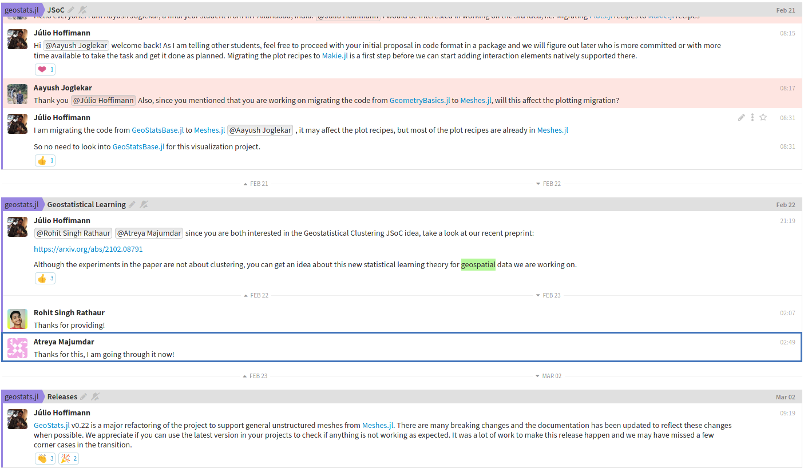

## Gitter

*(This channel is deprecated)*

The **Gitter** channel is the **oldest** channel. It does **not** support 
``\LaTeX`` nor syntax highlighting for Julia. We keep it around
because of its direct integration with GitHub accounts.

Click on the image to access past conversations:

## Zulip

The **Zulip** channel is the **newest** channel. It is fully-featured and
**open source**. We plan to make it the only official community channel
of the project in the future. Consider creating an account and pressing `?`
on the keyboard for navigation instructions.

Click on the image to join the channel:

