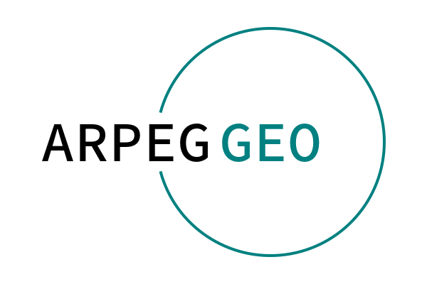

```@docs
GeoStats
```

!!! note "Star us on GitHub!"

    If you have found this software useful, please consider starring it on
    [GitHub](https://github.com/JuliaEarth/GeoStats.jl). This gives us an
    accurate lower bound of the (satisfied) user count.

Organizations using the framework:

```@raw html
<p align="center">
  
  
  
  
  
  
  
</p>
```

### Sponsors

```@raw html
<p align="center">
  <a href="https://arpeggeo.tech">
    
  </a>
</p>
```

Would like to become a sponsor? Press the sponsor button in our
[GitHub repository](https://github.com/JuliaEarth/GeoStats.jl).

### Textbooks

The following textbooks can be useful to learn the framework.
Click on the cover to learn more.

```@raw html
<p align="center">
  <a href="https://juliaearth.github.io/geospatial-data-science-with-julia">
    
  </a>
</p>
```

## Overview

```@example overview
using JSServe: Page # hide
Page(exportable=true, offline=true) # hide
```

In many fields of science, such as mining engineering, hydrogeology, petroleum
engineering, and environmental sciences, traditional statistical methods fail
to provide unbiased estimates of resources due to the presence of geospatial
correlation. Geostatistics (a.k.a. geospatial statistics) is the branch of
statistics developed to overcome this limitation. Particularly, it is the
branch that takes geospatial coordinates of data into account.

**GeoStats.jl** is an attempt to bring together bleeding-edge research in the
geostatistics community into a comprehensive framework for *geospatial data
science* and *geostatistical modeling*, as well as to empower researchers and
practitioners with a toolkit for fast assessment of different modeling approaches.
For a guided tour, please watch our JuliaCon2021 talk:

```@raw html
<p align="center">
<iframe style="width:560px;height:315px" src="https://www.youtube.com/embed/75A6zyn5pIE" title="Geostatistical Learning" frameborder="0" allow="accelerometer; autoplay; clipboard-write; encrypted-media; gyroscope; picture-in-picture" allowfullscreen></iframe>
</p>
```

If you have questions, feature requests, or would like to brainstorm ideas, don't
hesitate to start a topic in our [community channel](about/community.md).

## Installation

Get the latest stable release with Julia's package manager:

```
] add GeoStats
```

## Quick example

Below is a quick preview of the high-level interface:

```@example overview
using GeoStats

import WGLMakie as Mke

# attribute table
table = (; Z=[1.,0.,1.])

# coordinates for each row
coord = [(25.,25.), (50.,75.), (75.,50.)]

# georeference data
geotable = georef(table, coord)

# interpolation domain
grid = CartesianGrid(100, 100)

# choose an interpolation model
model = Kriging(GaussianVariogram(range=35.))

# perform interpolation over grid
interp = geotable |> Interpolate(grid, model)

# visualize the solution
viz(interp.geometry, color = interp.Z)
```

For a more detailed example, please consult the [Quickstart](quickstart.md).

## Video tutorials

A set of Pluto notebooks demonstrating important geostatistical concepts
is available in [GeoStatsTutorials](https://github.com/JuliaEarth/GeoStatsTutorials)
with an accompanying series of videos:

```@raw html
<p align="center">
<iframe style="width:560px;height:315px" src="https://www.youtube.com/embed/yDIK9onnZVw" frameborder="0" allow="accelerometer; autoplay; encrypted-media; gyroscope; picture-in-picture" allowfullscreen></iframe>
</p>
```

## Project organization

The project is split into various packages:

| Package | Description |
|:-------:|:------------|
| [GeoStats.jl](https://github.com/JuliaEarth/GeoStats.jl) | Main package reexporting full stack of packages for geostatistics. |
| [Meshes.jl](https://github.com/JuliaGeometry/Meshes.jl) | Computational geometry and advanced meshing algorithms. |
| [GeoTables.jl](https://github.com/JuliaEarth/GeoTables.jl) | Geospatial tables compatible with the framework. |
| [DataScienceTraits.jl](https://github.com/JuliaML/DataScienceTraits.jl) | Traits for geospatial data science. |
| [TableTransforms.jl](https://github.com/JuliaML/TableTransforms.jl) | Transforms and pipelines with tabular data. |
| [StatsLearnModels.jl](https://github.com/JuliaML/StatsLearnModels.jl) | Statistical learning models for geospatial prediction. |
| [Variography.jl](https://github.com/JuliaEarth/Variography.jl) | Variogram estimation and modeling, and related tools. |
| [PointPatterns.jl](https://github.com/JuliaEarth/PointPatterns.jl) | Geospatial point pattern analysis and synthesis. |
| [GeoStatsModels.jl](https://github.com/JuliaEarth/GeoStatsModels.jl) | Geostatistical models for geospatial interpolation. |
| [GeoStatsTransforms.jl](https://github.com/JuliaEarth/GeoStatsTransforms.jl) | Geostatistical transforms for geospatial data. |
| [GeoStatsSolvers.jl](https://github.com/JuliaEarth/GeoStatsSolvers.jl) | Built-in geostatistical solvers. |
| [GeoStatsBase.jl](https://github.com/JuliaEarth/GeoStatsBase.jl) | Base package with core definitions. |
| [Unitful.jl](https://github.com/PainterQubits/Unitful.jl) | Physical quantities with arbitrary units. |
| [CategoricalArrays.jl](https://github.com/JuliaData/CategoricalArrays.jl) | Categorical data types. |
| [CoDa.jl](https://github.com/JuliaEarth/CoDa.jl) | Compositional data types. |

Other packages can be installed separately for additional functionality:

| Package | Description |
|:-------:|:------------|
| [GeoIO.jl](https://github.com/JuliaEarth/GeoIO.jl) | Load/save geospatial tables in various formats. |
| [DrillHoles.jl](https://github.com/JuliaEarth/DrillHoles.jl) | Desurvey/composite drillhole data. |
| [GeoArtifacts.jl](https://github.com/JuliaEarth/GeoArtifacts.jl) | Artifacts for geospatial data science. |

Besides the packages above, the project can be extended with [solver packages](solvers/overview.md).

## Citing the software

If you find this software useful in your work, please consider citing it: 

[](https://doi.org/10.21105/joss.00692)
[](https://zenodo.org/badge/latestdoi/33827844)

```bibtex
@ARTICLE{Hoffimann2018,
  title={GeoStats.jl – High-performance geostatistics in Julia},
  author={Hoffimann, Júlio},
  journal={Journal of Open Source Software},
  publisher={The Open Journal},
  volume={3},
  pages={692},
  number={24},
  ISSN={2475-9066},
  DOI={10.21105/joss.00692},
  url={https://dx.doi.org/10.21105/joss.00692},
  year={2018},
  month={Apr}
}
```

We ❤ to see our [list of publications](resources/publications.md) growing.
