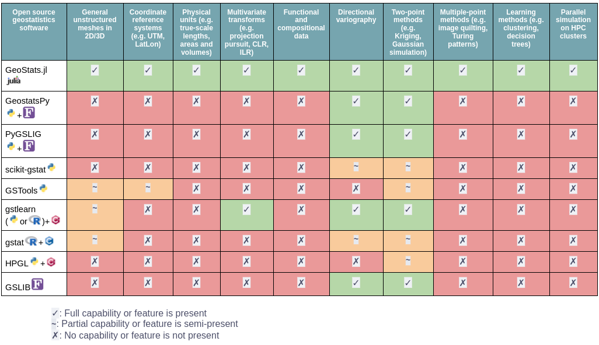

```@docs
GeoStats
```

!!! note "Star us on GitHub!"

    If you have found this software useful, please consider starring it on
    [GitHub](https://github.com/JuliaEarth/GeoStats.jl). This gives us an
    accurate lower bound of the (satisfied) user count.

Organizations using the framework:

```@raw html
<p align="center">
  
  
  
  
  
  
  
</p>
```

### Sponsors

```@raw html
<p align="center">
  <a href="https://arpeggeo.tech">
    
  </a>
</p>
```

Would like to become a sponsor? Press the sponsor button in our
[GitHub repository](https://github.com/JuliaEarth/GeoStats.jl).

## Overview

In many fields of science, such as mining engineering, hydrogeology, petroleum
engineering, and environmental sciences, traditional statistical methods fail
to provide unbiased estimates of resources due to the presence of geospatial
association. Geostatistics (a.k.a. geospatial statistics) is the branch of
statistics developed to overcome this limitation. Particularly, it is the
branch that takes geospatial coordinates of data into account. Some major
highlights of **GeoStats.jl** are:

- It is **simple**: has a very short learning curve and requires writing minimal code 😌
- It is **general**: supports all types of geospatial domains, including unstructured meshes 👍
- It is **native**: fully written in Julia for maximum flexibility and performance 🚀
- Has an **extensive library** of algorithms from the geostatistics literature 📚

The following table generated on March 11, 2025 provides a
general comparison with other software:

```@raw html
<p align="center">
  
</p>
```

Our JuliaCon2021 talk provides an overview of
[geostatistical learning](https://www.frontiersin.org/journals/applied-mathematics-and-statistics/articles/10.3389/fams.2021.689393/full),
which is one of the many geostatistical problems addressed
by the framework:

```@raw html
<p align="center">
<iframe style="width:560px;height:315px" src="https://www.youtube.com/embed/75A6zyn5pIE" title="Geostatistical Learning" frameborder="0" allow="accelerometer; autoplay; clipboard-write; encrypted-media; gyroscope; picture-in-picture" allowfullscreen></iframe>
</p>
```

Consider reading the [Geospatial Data Science with Julia](https://juliaearth.github.io/geospatial-data-science-with-julia)
book before reading this documentation. If you have questions, or would
like to brainstorm ideas, don't hesitate to start a topic in our
[community channel](about/community.md).

```@raw html
<p align="center">
  <a href="https://juliaearth.github.io/geospatial-data-science-with-julia">
    
  </a>
</p>
```

## Installation

Get the latest stable release with Julia's package manager:

```julia
using Pkg
Pkg.add("GeoStats")
```

## Quick example

Below is an example of geostatistical interpolation of point data
over a Cartesian grid with a Kriging model:

```@example overview
# load framework
using GeoStats

# load visualization backend
import CairoMakie as Mke

# attribute table
table = (; z=[1.,0.,1.])

# coordinates for each row
coord = [(25.,25.), (50.,75.), (75.,50.)]

# georeference data
geotable = georef(table, coord)

# interpolation domain
grid = CartesianGrid(100, 100)

# choose an interpolation model
model = Kriging(GaussianVariogram(range=35.))

# perform interpolation over grid
interp = geotable |> Interpolate(grid, model=model)

# visualize the solution
interp |> viewer
```

## Project organization

The project is split into various packages:

| Package | Description |
|:-------:|:------------|
| [GeoStats.jl](https://github.com/JuliaEarth/GeoStats.jl) | Main package reexporting full stack of packages for geostatistics. |
| [Meshes.jl](https://github.com/JuliaGeometry/Meshes.jl) | Computational geometry and advanced meshing algorithms. |
| [CoordRefSystems.jl](https://github.com/JuliaEarth/CoordRefSystems.jl) | Unitful coordinate reference systems. |
| [CoordGridTransforms.jl](https://github.com/JuliaEarth/CoordGridTransforms.jl) | Coordinate transforms with offset grids. |
| [GeoTables.jl](https://github.com/JuliaEarth/GeoTables.jl) | Geospatial tables compatible with the framework. |
| [DataScienceTraits.jl](https://github.com/JuliaML/DataScienceTraits.jl) | Traits for geospatial data science. |
| [TableTransforms.jl](https://github.com/JuliaML/TableTransforms.jl) | Transforms and pipelines with tabular data. |
| [StatsLearnModels.jl](https://github.com/JuliaML/StatsLearnModels.jl) | Statistical learning models for geospatial prediction. |
| [GeoStatsBase.jl](https://github.com/JuliaEarth/GeoStatsBase.jl) | Base package with core geostatistical definitions. |
| [GeoStatsFunctions.jl](https://github.com/JuliaEarth/GeoStatsFunctions.jl) | Geostatistical functions and related tools. |
| [GeoStatsModels.jl](https://github.com/JuliaEarth/GeoStatsModels.jl) | Geostatistical models for geospatial interpolation. |
| [GeoStatsProcesses.jl](https://github.com/JuliaEarth/GeoStatsProcesses.jl) | Geostatistical processes for geospatial simulation. |
| [GeoStatsTransforms.jl](https://github.com/JuliaEarth/GeoStatsTransforms.jl) | Geostatistical transforms for geospatial data. |
| [GeoStatsValidation.jl](https://github.com/JuliaEarth/GeoStatsValidation.jl) | Geostatistical validation methods. |

Other packages can be installed separately for additional functionality:

| Package | Description |
|:-------:|:------------|
| [GeoIO.jl](https://github.com/JuliaEarth/GeoIO.jl) | Load/save geospatial tables in various formats. |
| [GeoArtifacts.jl](https://github.com/JuliaEarth/GeoArtifacts.jl) | Artifacts (e.g., datasets) for geospatial data science. |
| [GeoStatsImages.jl](https://github.com/JuliaEarth/GeoStatsImages.jl) | Training images for geostatistical simulation. |
| [DrillHoles.jl](https://github.com/JuliaEarth/DrillHoles.jl) | Desurvey/composite drillhole data. |

## Citing the software

If you find this software useful in your work, please consider citing it: 

[](https://doi.org/10.21105/joss.00692)
[](https://zenodo.org/badge/latestdoi/33827844)

```bibtex
@ARTICLE{Hoffimann2018,
  title={GeoStats.jl – High-performance geostatistics in Julia},
  author={Hoffimann, Júlio},
  journal={Journal of Open Source Software},
  publisher={The Open Journal},
  volume={3},
  pages={692},
  number={24},
  ISSN={2475-9066},
  DOI={10.21105/joss.00692},
  url={https://dx.doi.org/10.21105/joss.00692},
  year={2018},
  month={Apr}
}
```

We ❤ to see our [list of publications](resources/publications.md) growing.

## Contributors

This project would not be possible without the contributions of:

```@raw html
<!-- ALL-CONTRIBUTORS-LIST:START - Do not remove or modify this section -->
<!-- prettier-ignore-start -->
<!-- markdownlint-disable -->
<table>
  <tbody>
    <tr>
      <td align="center" valign="top" width="14.28%"><a href="https://www.evetion.nl"><br /><sub><b>Maarten Pronk</b></sub></a><br /><a href="#infra-evetion" title="Infrastructure (Hosting, Build-Tools, etc)">🚇</a></td>
      <td align="center" valign="top" width="14.28%"><a href="https://github.com/visr"><br /><sub><b>Martijn Visser</b></sub></a><br /><a href="https://github.com/JuliaEarth/GeoStats.jl/commits?author=visr" title="Code">💻</a></td>
      <td align="center" valign="top" width="14.28%"><a href="https://github.com/fredrikekre"><br /><sub><b>Fredrik Ekre</b></sub></a><br /><a href="#infra-fredrikekre" title="Infrastructure (Hosting, Build-Tools, etc)">🚇</a></td>
      <td align="center" valign="top" width="14.28%"><a href="http://dldx.org"><br /><sub><b>Durand D'souza</b></sub></a><br /><a href="https://github.com/JuliaEarth/GeoStats.jl/commits?author=dldx" title="Code">💻</a></td>
      <td align="center" valign="top" width="14.28%"><a href="https://github.com/mortenpi"><br /><sub><b>Morten Piibeleht</b></sub></a><br /><a href="https://github.com/JuliaEarth/GeoStats.jl/commits?author=mortenpi" title="Documentation">📖</a></td>
      <td align="center" valign="top" width="14.28%"><a href="https://github.com/tkelman"><br /><sub><b>Tony Kelman</b></sub></a><br /><a href="#infra-tkelman" title="Infrastructure (Hosting, Build-Tools, etc)">🚇</a></td>
      <td align="center" valign="top" width="14.28%"><a href="https://www.linkedin.com/in/madnansiddique/"><br /><sub><b>M. A. Siddique</b></sub></a><br /><a href="#question-masiddique" title="Answering Questions">💬</a></td>
    </tr>
    <tr>
      <td align="center" valign="top" width="14.28%"><a href="https://github.com/asinghvi17"><br /><sub><b>Anshul Singhvi</b></sub></a><br /><a href="https://github.com/JuliaEarth/GeoStats.jl/commits?author=asinghvi17" title="Documentation">📖</a></td>
      <td align="center" valign="top" width="14.28%"><a href="https://zdroid.github.io"><br /><sub><b>Zlatan Vasović</b></sub></a><br /><a href="https://github.com/JuliaEarth/GeoStats.jl/commits?author=zdroid" title="Documentation">📖</a></td>
      <td align="center" valign="top" width="14.28%"><a href="https://www.bpasquier.com/"><br /><sub><b>Benoit Pasquier</b></sub></a><br /><a href="https://github.com/JuliaEarth/GeoStats.jl/commits?author=briochemc" title="Code">💻</a></td>
      <td align="center" valign="top" width="14.28%"><a href="https://github.com/exepulveda"><br /><sub><b>exepulveda</b></sub></a><br /><a href="https://github.com/JuliaEarth/GeoStats.jl/commits?author=exepulveda" title="Code">💻</a></td>
      <td align="center" valign="top" width="14.28%"><a href="https://github.com/errearanhas"><br /><sub><b>Renato Aranha</b></sub></a><br /><a href="https://github.com/JuliaEarth/GeoStats.jl/commits?author=errearanhas" title="Tests">⚠️</a></td>
      <td align="center" valign="top" width="14.28%"><a href="http://pkofod.com/"><br /><sub><b>Patrick Kofod Mogensen</b></sub></a><br /><a href="https://github.com/JuliaEarth/GeoStats.jl/commits?author=pkofod" title="Code">💻</a></td>
      <td align="center" valign="top" width="14.28%"><a href="http://xuk.ai"><br /><sub><b>Kai Xu</b></sub></a><br /><a href="https://github.com/JuliaEarth/GeoStats.jl/commits?author=xukai92" title="Code">💻</a></td>
    </tr>
    <tr>
      <td align="center" valign="top" width="14.28%"><a href="https://github.com/PaulMatlashewski"><br /><sub><b>Paul Matlashewski</b></sub></a><br /><a href="https://github.com/JuliaEarth/GeoStats.jl/commits?author=PaulMatlashewski" title="Code">💻</a></td>
      <td align="center" valign="top" width="14.28%"><a href="https://github.com/riyadm"><br /><sub><b>Riyad Muradov</b></sub></a><br /><a href="https://github.com/JuliaEarth/GeoStats.jl/commits?author=riyadm" title="Code">💻</a></td>
      <td align="center" valign="top" width="14.28%"><a href="https://github.com/ammilten"><br /><sub><b>Alex Miltenberger</b></sub></a><br /><a href="https://github.com/JuliaEarth/GeoStats.jl/commits?author=ammilten" title="Code">💻</a></td>
      <td align="center" valign="top" width="14.28%"><a href="https://www.linkedin.com/in/LakshyaKhatri"><br /><sub><b>Lakshya Khatri</b></sub></a><br /><a href="https://github.com/JuliaEarth/GeoStats.jl/commits?author=LakshyaKhatri" title="Code">💻</a></td>
      <td align="center" valign="top" width="14.28%"><a href="http://bouchet-valat.site.ined.fr"><br /><sub><b>Milan Bouchet-Valat</b></sub></a><br /><a href="https://github.com/JuliaEarth/GeoStats.jl/commits?author=nalimilan" title="Documentation">📖</a></td>
      <td align="center" valign="top" width="14.28%"><a href="http://www.linkedin.com/in/rmcaixeta"><br /><sub><b>Rafael Caixeta</b></sub></a><br /><a href="https://github.com/JuliaEarth/GeoStats.jl/commits?author=rmcaixeta" title="Code">💻</a></td>
      <td align="center" valign="top" width="14.28%"><a href="https://github.com/ElOceanografo"><br /><sub><b>Sam</b></sub></a><br /><a href="#infra-ElOceanografo" title="Infrastructure (Hosting, Build-Tools, etc)">🚇</a></td>
    </tr>
    <tr>
      <td align="center" valign="top" width="14.28%"><a href="http://nitishgadangi.github.io"><br /><sub><b>Nitish Gadangi</b></sub></a><br /><a href="https://github.com/JuliaEarth/GeoStats.jl/commits?author=NitishGadangi" title="Documentation">📖</a> <a href="#infra-NitishGadangi" title="Infrastructure (Hosting, Build-Tools, etc)">🚇</a></td>
      <td align="center" valign="top" width="14.28%"><a href="https://github.com/Mattriks"><br /><sub><b>Mattriks</b></sub></a><br /><a href="https://github.com/JuliaEarth/GeoStats.jl/commits?author=Mattriks" title="Code">💻</a></td>
      <td align="center" valign="top" width="14.28%"><a href="https://cormullion.github.io"><br /><sub><b>cormullion</b></sub></a><br /><a href="https://github.com/JuliaEarth/GeoStats.jl/commits?author=cormullion" title="Documentation">📖</a></td>
      <td align="center" valign="top" width="14.28%"><a href="http://maurow.bitbucket.io/"><br /><sub><b>Mauro</b></sub></a><br /><a href="https://github.com/JuliaEarth/GeoStats.jl/commits?author=mauro3" title="Code">💻</a></td>
      <td align="center" valign="top" width="14.28%"><a href="https://github.com/cyborg1995"><br /><sub><b>Gaurav Wasnik</b></sub></a><br /><a href="https://github.com/JuliaEarth/GeoStats.jl/commits?author=cyborg1995" title="Code">💻</a></td>
      <td align="center" valign="top" width="14.28%"><a href="https://github.com/atreyamaj"><br /><sub><b>Atreya Majumdar</b></sub></a><br /><a href="https://github.com/JuliaEarth/GeoStats.jl/commits?author=atreyamaj" title="Documentation">📖</a></td>
      <td align="center" valign="top" width="14.28%"><a href="https://github.com/hameye"><br /><sub><b>Hadrien Meyer</b></sub></a><br /><a href="https://github.com/JuliaEarth/GeoStats.jl/commits?author=hameye" title="Code">💻</a></td>
    </tr>
    <tr>
      <td align="center" valign="top" width="14.28%"><a href="https://github.com/felixcremer"><br /><sub><b>Felix Cremer</b></sub></a><br /><a href="https://github.com/JuliaEarth/GeoStats.jl/commits?author=felixcremer" title="Documentation">📖</a></td>
      <td align="center" valign="top" width="14.28%"><a href="http://storopoli.io"><br /><sub><b>Jose Storopoli</b></sub></a><br /><a href="#infra-storopoli" title="Infrastructure (Hosting, Build-Tools, etc)">🚇</a></td>
      <td align="center" valign="top" width="14.28%"><a href="https://github.com/fnaghetini"><br /><sub><b>Franco Naghetini</b></sub></a><br /><a href="https://github.com/JuliaEarth/GeoStats.jl/commits?author=fnaghetini" title="Code">💻</a></td>
      <td align="center" valign="top" width="14.28%"><a href="https://www.nicholasshea.com/"><br /><sub><b>Nicholas Shea</b></sub></a><br /><a href="https://github.com/JuliaEarth/GeoStats.jl/commits?author=nshea3" title="Code">💻</a></td>
      <td align="center" valign="top" width="14.28%"><a href="http://math.mit.edu/~stevenj"><br /><sub><b>Steven G. Johnson</b></sub></a><br /><a href="#infra-stevengj" title="Infrastructure (Hosting, Build-Tools, etc)">🚇</a></td>
      <td align="center" valign="top" width="14.28%"><a href="https://github.com/mrr00b00t"><br /><sub><b>José A. S. Silva</b></sub></a><br /><a href="https://github.com/JuliaEarth/GeoStats.jl/commits?author=mrr00b00t" title="Code">💻</a></td>
      <td align="center" valign="top" width="14.28%"><a href="https://github.com/marlonsmathias"><br /><sub><b>Marlon Sproesser Mathias</b></sub></a><br /><a href="https://github.com/JuliaEarth/GeoStats.jl/commits?author=marlonsmathias" title="Code">💻</a></td>
    </tr>
    <tr>
      <td align="center" valign="top" width="14.28%"><a href="https://github.com/eliascarv"><br /><sub><b>Elias Carvalho</b></sub></a><br /><a href="https://github.com/JuliaEarth/GeoStats.jl/commits?author=eliascarv" title="Code">💻</a></td>
      <td align="center" valign="top" width="14.28%"><a href="https://github.com/ClaroHenrique"><br /><sub><b>ClaroHenrique</b></sub></a><br /><a href="https://github.com/JuliaEarth/GeoStats.jl/commits?author=ClaroHenrique" title="Code">💻</a></td>
      <td align="center" valign="top" width="14.28%"><a href="https://github.com/decarvalhojunior-fh"><br /><sub><b>decarvalhojunior-fh</b></sub></a><br /><a href="https://github.com/JuliaEarth/GeoStats.jl/commits?author=decarvalhojunior-fh" title="Code">💻</a></td>
      <td align="center" valign="top" width="14.28%"><a href="https://github.com/DianaPat"><br /><sub><b>DianaPat</b></sub></a><br /><a href="https://github.com/JuliaEarth/GeoStats.jl/commits?author=DianaPat" title="Code">💻</a></td>
      <td align="center" valign="top" width="14.28%"><a href="https://github.com/jwscook"><br /><sub><b>James Cook</b></sub></a><br /><a href="https://github.com/JuliaEarth/GeoStats.jl/commits?author=jwscook" title="Code">💻</a></td>
      <td align="center" valign="top" width="14.28%"><a href="https://github.com/vickydeka"><br /><sub><b>vickydeka</b></sub></a><br /><a href="https://github.com/JuliaEarth/GeoStats.jl/commits?author=vickydeka" title="Code">💻</a></td>
      <td align="center" valign="top" width="14.28%"><a href="https://github.com/lihua-cat"><br /><sub><b>刘昊</b></sub></a><br /><a href="https://github.com/JuliaEarth/GeoStats.jl/commits?author=lihua-cat" title="Code">💻</a></td>
    </tr>
    <tr>
      <td align="center" valign="top" width="14.28%"><a href="https://github.com/stla"><br /><sub><b>stla</b></sub></a><br /><a href="https://github.com/JuliaEarth/GeoStats.jl/commits?author=stla" title="Code">💻</a></td>
      <td align="center" valign="top" width="14.28%"><a href="https://github.com/dorn-gerhard"><br /><sub><b>Gerhard Dorn</b></sub></a><br /><a href="https://github.com/JuliaEarth/GeoStats.jl/commits?author=dorn-gerhard" title="Code">💻</a></td>
      <td align="center" valign="top" width="14.28%"><a href="https://github.com/jackbeagley"><br /><sub><b>Jack Beagley</b></sub></a><br /><a href="https://github.com/JuliaEarth/GeoStats.jl/commits?author=jackbeagley" title="Code">💻</a></td>
      <td align="center" valign="top" width="14.28%"><a href="https://github.com/cserteGT3"><br /><sub><b>cserteGT3</b></sub></a><br /><a href="https://github.com/JuliaEarth/GeoStats.jl/commits?author=cserteGT3" title="Code">💻</a></td>
      <td align="center" valign="top" width="14.28%"><a href="http://kylebeggs.com"><br /><sub><b>Kyle Beggs</b></sub></a><br /><a href="https://github.com/JuliaEarth/GeoStats.jl/commits?author=kylebeggs" title="Code">💻</a></td>
      <td align="center" valign="top" width="14.28%"><a href="https://erickchacon.gitlab.io/"><br /><sub><b>Dr. Erick A. Chacón Montalván</b></sub></a><br /><a href="https://github.com/JuliaEarth/GeoStats.jl/commits?author=ErickChacon" title="Code">💻</a></td>
      <td align="center" valign="top" width="14.28%"><a href="https://github.com/mfsch"><br /><sub><b>Manuel Schmid</b></sub></a><br /><a href="https://github.com/JuliaEarth/GeoStats.jl/commits?author=mfsch" title="Code">💻</a></td>
    </tr>
    <tr>
      <td align="center" valign="top" width="14.28%"><a href="https://github.com/longemen3000"><br /><sub><b>Andrés Riedemann</b></sub></a><br /><a href="https://github.com/JuliaEarth/GeoStats.jl/commits?author=longemen3000" title="Code">💻</a></td>
      <td align="center" valign="top" width="14.28%"><a href="https://hyrodium.github.io"><br /><sub><b>Yuto Horikawa</b></sub></a><br /><a href="https://github.com/JuliaEarth/GeoStats.jl/commits?author=hyrodium" title="Code">💻</a></td>
      <td align="center" valign="top" width="14.28%"><a href="https://github.com/conordoherty"><br /><sub><b>Conor Doherty</b></sub></a><br /><a href="https://github.com/JuliaEarth/GeoStats.jl/commits?author=conordoherty" title="Documentation">📖</a></td>
      <td align="center" valign="top" width="14.28%"><a href="https://github.com/spaette"><br /><sub><b>spaette</b></sub></a><br /><a href="https://github.com/JuliaEarth/GeoStats.jl/commits?author=spaette" title="Documentation">📖</a></td>
      <td align="center" valign="top" width="14.28%"><a href="https://github.com/ashwani-rathee"><br /><sub><b>Ashwani Rathee</b></sub></a><br /><a href="https://github.com/JuliaEarth/GeoStats.jl/commits?author=ashwani-rathee" title="Documentation">📖</a></td>
      <td align="center" valign="top" width="14.28%"><a href="http://astroautomata.com"><br /><sub><b>Miles Cranmer</b></sub></a><br /><a href="https://github.com/JuliaEarth/GeoStats.jl/commits?author=MilesCranmer" title="Code">💻</a></td>
      <td align="center" valign="top" width="14.28%"><a href="https://github.com/DanielVandH"><br /><sub><b>Daniel VandenHeuvel</b></sub></a><br /><a href="https://github.com/JuliaEarth/GeoStats.jl/commits?author=DanielVandH" title="Documentation">📖</a></td>
    </tr>
    <tr>
      <td align="center" valign="top" width="14.28%"><a href="https://github.com/chrstphrbrns"><br /><sub><b>Christopher Burns</b></sub></a><br /><a href="https://github.com/JuliaEarth/GeoStats.jl/commits?author=chrstphrbrns" title="Code">💻</a></td>
      <td align="center" valign="top" width="14.28%"><a href="https://www.linkedin.com/in/essamwisam/"><br /><sub><b>Essam</b></sub></a><br /><a href="https://github.com/JuliaEarth/GeoStats.jl/commits?author=EssamWisam" title="Code">💻</a> <a href="https://github.com/JuliaEarth/GeoStats.jl/commits?author=EssamWisam" title="Documentation">📖</a></td>
      <td align="center" valign="top" width="14.28%"><a href="https://github.com/luschiro"><br /><sub><b>Lucas R. Schiavetti</b></sub></a><br /><a href="https://github.com/JuliaEarth/GeoStats.jl/issues?q=author%3Aluschiro" title="Bug reports">🐛</a></td>
      <td align="center" valign="top" width="14.28%"><a href="https://ehgus.github.io/"><br /><sub><b>Lee, Dohyeon</b></sub></a><br /><a href="https://github.com/JuliaEarth/GeoStats.jl/commits?author=ehgus" title="Code">💻</a></td>
      <td align="center" valign="top" width="14.28%"><a href="https://github.com/Jay-sanjay"><br /><sub><b>Jay-sanjay</b></sub></a><br /><a href="https://github.com/JuliaEarth/GeoStats.jl/commits?author=Jay-sanjay" title="Code">💻</a></td>
      <td align="center" valign="top" width="14.28%"><a href="https://github.com/remann2"><br /><sub><b>Steve</b></sub></a><br /><a href="https://github.com/JuliaEarth/GeoStats.jl/commits?author=remann2" title="Code">💻</a></td>
      <td align="center" valign="top" width="14.28%"><a href="https://github.com/MachSilva"><br /><sub><b>Felipe Silva</b></sub></a><br /><a href="https://github.com/JuliaEarth/GeoStats.jl/commits?author=MachSilva" title="Code">💻</a></td>
    </tr>
    <tr>
      <td align="center" valign="top" width="14.28%"><a href="https://github.com/ajahraus"><br /><sub><b>Adam J</b></sub></a><br /><a href="https://github.com/JuliaEarth/GeoStats.jl/commits?author=ajahraus" title="Code">💻</a></td>
      <td align="center" valign="top" width="14.28%"><a href="http://ziotom78.blogspot.it/"><br /><sub><b>Maurizio Tomasi</b></sub></a><br /><a href="https://github.com/JuliaEarth/GeoStats.jl/commits?author=ziotom78" title="Code">💻</a></td>
      <td align="center" valign="top" width="14.28%"><a href="https://github.com/markmbaum"><br /><sub><b>Mark Baum</b></sub></a><br /><a href="https://github.com/JuliaEarth/GeoStats.jl/commits?author=markmbaum" title="Code">💻</a></td>
      <td align="center" valign="top" width="14.28%"><a href="http://page.romeov.me"><br /><sub><b>RomeoV</b></sub></a><br /><a href="https://github.com/JuliaEarth/GeoStats.jl/commits?author=RomeoV" title="Code">💻</a></td>
      <td align="center" valign="top" width="14.28%"><a href="https://github.com/BambOoxX"><br /><sub><b>BambOoxX</b></sub></a><br /><a href="#infra-BambOoxX" title="Infrastructure (Hosting, Build-Tools, etc)">🚇</a></td>
      <td align="center" valign="top" width="14.28%"><a href="http://ettersi.github.io"><br /><sub><b>Simon Etter</b></sub></a><br /><a href="https://github.com/JuliaEarth/GeoStats.jl/commits?author=ettersi" title="Documentation">📖</a></td>
      <td align="center" valign="top" width="14.28%"><a href="https://www.remivezy.com/"><br /><sub><b>Rémi Vezy</b></sub></a><br /><a href="https://github.com/JuliaEarth/GeoStats.jl/commits?author=VEZY" title="Code">💻</a></td>
    </tr>
    <tr>
      <td align="center" valign="top" width="14.28%"><a href="https://github.com/disberd"><br /><sub><b>Alberto Mengali</b></sub></a><br /><a href="https://github.com/JuliaEarth/GeoStats.jl/commits?author=disberd" title="Code">💻</a></td>
      <td align="center" valign="top" width="14.28%"><a href="https://www.math.uni-hamburg.de/en/home/lampert"><br /><sub><b>Joshua Lampert</b></sub></a><br /><a href="https://github.com/JuliaEarth/GeoStats.jl/commits?author=JoshuaLampert" title="Code">💻</a></td>
      <td align="center" valign="top" width="14.28%"><a href="https://salbalkus.github.io/"><br /><sub><b>Salvador Balkus</b></sub></a><br /><a href="https://github.com/JuliaEarth/GeoStats.jl/commits?author=salbalkus" title="Code">💻</a></td>
      <td align="center" valign="top" width="14.28%"><a href="https://github.com/TimG1964"><br /><sub><b>TimG1964</b></sub></a><br /><a href="https://github.com/JuliaEarth/GeoStats.jl/commits?author=TimG1964" title="Code">💻</a></td>
      <td align="center" valign="top" width="14.28%"><a href="https://github.com/romu545"><br /><sub><b>Rafael Mendoza Ureche</b></sub></a><br /><a href="https://github.com/JuliaEarth/GeoStats.jl/commits?author=romu545" title="Code">💻</a></td>
      <td align="center" valign="top" width="14.28%"><a href="https://www.linkedin.com/in/simon-kok-lupemba-434099162/"><br /><sub><b>Simon Kok Lupemba</b></sub></a><br /><a href="https://github.com/JuliaEarth/GeoStats.jl/commits?author=lupemba" title="Code">💻</a></td>
      <td align="center" valign="top" width="14.28%"><a href="https://github.com/uriele"><br /><sub><b>Marco</b></sub></a><br /><a href="https://github.com/JuliaEarth/GeoStats.jl/commits?author=uriele" title="Code">💻</a></td>
    </tr>
    <tr>
      <td align="center" valign="top" width="14.28%"><a href="http://davibarreira.github.io"><br /><sub><b>Davi Sales Barreira</b></sub></a><br /><a href="https://github.com/JuliaEarth/GeoStats.jl/commits?author=davibarreira" title="Code">💻</a></td>
      <td align="center" valign="top" width="14.28%"><a href="https://github.com/mikeingold"><br /><sub><b>Michael Ingold</b></sub></a><br /><a href="https://github.com/JuliaEarth/GeoStats.jl/commits?author=mikeingold" title="Code">💻</a></td>
      <td align="center" valign="top" width="14.28%"><a href="https://github.com/stepanoslejsek"><br /><sub><b>Štěpán Ošlejšek</b></sub></a><br /><a href="https://github.com/JuliaEarth/GeoStats.jl/commits?author=stepanoslejsek" title="Code">💻</a></td>
      <td align="center" valign="top" width="14.28%"><a href="https://github.com/souma4"><br /><sub><b>Jeffrey Chandler</b></sub></a><br /><a href="https://github.com/JuliaEarth/GeoStats.jl/commits?author=souma4" title="Code">💻</a></td>
      <td align="center" valign="top" width="14.28%"><a href="https://github.com/CarlBittendorf"><br /><sub><b>Carl Bittendorf</b></sub></a><br /><a href="https://github.com/JuliaEarth/GeoStats.jl/commits?author=CarlBittendorf" title="Code">💻</a></td>
      <td align="center" valign="top" width="14.28%"><a href="https://github.com/ghyatzo"><br /><sub><b>cschen</b></sub></a><br /><a href="https://github.com/JuliaEarth/GeoStats.jl/commits?author=ghyatzo" title="Code">💻</a></td>
      <td align="center" valign="top" width="14.28%"><a href="https://jthatch.com"><br /><sub><b>Thatcher Chamberlin</b></sub></a><br /><a href="https://github.com/JuliaEarth/GeoStats.jl/commits?author=ThatcherC" title="Code">💻</a></td>
    </tr>
    <tr>
      <td align="center" valign="top" width="14.28%"><a href="http://omar-elrefaei.github.io"><br /><sub><b>Omar Elrefaei</b></sub></a><br /><a href="https://github.com/JuliaEarth/GeoStats.jl/commits?author=Omar-Elrefaei" title="Code">💻</a></td>
      <td align="center" valign="top" width="14.28%"><a href="https://github.com/EdoKara"><br /><sub><b>Andrew Brown</b></sub></a><br /><a href="https://github.com/JuliaEarth/GeoStats.jl/commits?author=EdoKara" title="Documentation">📖</a></td>
      <td align="center" valign="top" width="14.28%"><a href="https://halleysfifthinc.github.io"><br /><sub><b>Allen Hill</b></sub></a><br /><a href="https://github.com/JuliaEarth/GeoStats.jl/commits?author=halleysfifthinc" title="Documentation">📖</a></td>
      <td align="center" valign="top" width="14.28%"><a href="https://github.com/nsajko"><br /><sub><b>Neven Sajko</b></sub></a><br /><a href="https://github.com/JuliaEarth/GeoStats.jl/commits?author=nsajko" title="Code">💻</a></td>
      <td align="center" valign="top" width="14.28%"><a href="https://github.com/jamesalster"><br /><sub><b>jamesalster</b></sub></a><br /><a href="https://github.com/JuliaEarth/GeoStats.jl/commits?author=jamesalster" title="Code">💻</a> <a href="https://github.com/JuliaEarth/GeoStats.jl/commits?author=jamesalster" title="Documentation">📖</a></td>
      <td align="center" valign="top" width="14.28%"><a href="http://luminescentai.com"><br /><sub><b>Paul Shen</b></sub></a><br /><a href="https://github.com/JuliaEarth/GeoStats.jl/commits?author=paulxshen" title="Code">💻</a></td>
      <td align="center" valign="top" width="14.28%"><a href="http://www.debsankha.net/"><br /><sub><b>Debsankha Manik</b></sub></a><br /><a href="https://github.com/JuliaEarth/GeoStats.jl/commits?author=debsankha" title="Code">💻</a></td>
    </tr>
    <tr>
      <td align="center" valign="top" width="14.28%"><a href="https://github.com/tcarion"><br /><sub><b>Tristan Carion</b></sub></a><br /><a href="https://github.com/JuliaEarth/GeoStats.jl/commits?author=tcarion" title="Code">💻</a></td>
      <td align="center" valign="top" width="14.28%"><a href="https://github.com/bencherian"><br /><sub><b>Benjamin Cherian</b></sub></a><br /><a href="https://github.com/JuliaEarth/GeoStats.jl/commits?author=bencherian" title="Documentation">📖</a></td>
      <td align="center" valign="top" width="14.28%"><a href="https://fabianbarrett.github.io/"><br /><sub><b>Ben Barrett</b></sub></a><br /><a href="https://github.com/JuliaEarth/GeoStats.jl/commits?author=FabianBarrett" title="Code">💻</a></td>
      <td align="center" valign="top" width="14.28%"><a href="https://davidmetivier.mistea.inrae.fr/"><br /><sub><b>David Métivier</b></sub></a><br /><a href="https://github.com/JuliaEarth/GeoStats.jl/commits?author=dmetivie" title="Code">💻</a></td>
      <td align="center" valign="top" width="14.28%"><a href="https://github.com/marcosdanieldasilva"><br /><sub><b>Marcos Daniel da Silva</b></sub></a><br /><a href="https://github.com/JuliaEarth/GeoStats.jl/commits?author=marcosdanieldasilva" title="Code">💻</a></td>
      <td align="center" valign="top" width="14.28%"><a href="https://github.com/henry2004y"><br /><sub><b>Hongyang Zhou</b></sub></a><br /><a href="#infra-henry2004y" title="Infrastructure (Hosting, Build-Tools, etc)">🚇</a></td>
    </tr>
  </tbody>
</table>

<!-- markdownlint-restore -->
<!-- prettier-ignore-end -->

<!-- ALL-CONTRIBUTORS-LIST:END -->
```
