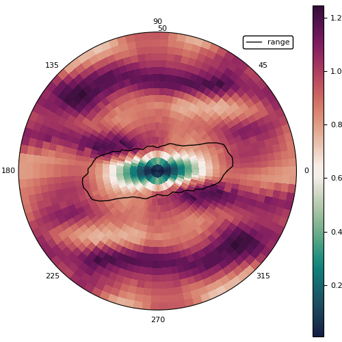

# Plotting

GeoStats.jl is integrated with the Julia [Plots.jl](https://github.com/JuliaPlots/Plots.jl) project.
This means that many objects defined in the package can be plotted directly without data format
conversions.

For example, below we plot various theoretical variograms with the `plot` command from Plots.jl:

```@example plots
using GeoStats
using Plots
gr(size=(600,400)) # hide

plot(GaussianVariogram(), maxlag=3., label="Gaussian")
plot!(ExponentialVariogram(), maxlag=3., label="Exponential")
plot!(SphericalVariogram(), maxlag=3., label="Spherical")
plot!(MaternVariogram(), maxlag=3., label="Matern")
savefig("images/variograms.svg") # hide
```


and various spatial domains:

```@example plots
plot(RegularGrid{Float64}(10,10,10))
savefig("images/regulargrid.svg") # hide
```


```@example plots
plot(PointSet(rand(3,10)))
savefig("images/pointset.svg") # hide
```


Besides plotting GeoStats.jl objects directly, a few other plots are provided for
exploring spatial data.

## hscatter

A hscatter plot between two variables `var1` and `var2` (possibly with `var2` =
`var1`) is a simple scatter plot in which the dots represent all ordered pairs of
values of `var1` and `var2` at a given lag `h`.

```@example plots
gr(size=(800,300)) # hide
Z = [10sin(i/10) + j for i in 1:100, j in 1:200]

Ω = RegularGridData{Float64}(OrderedDict(:Z=>Z))

hscatter(sample(Ω, 500), :Z, lags=[0.,20.,50.])
savefig("images/hscatter.svg") # hide
```


## varplane

A variogram plane (i.e. `varplane`) plot is a visualization that displays a collection of directional
variograms for all angles in a given plane for 2D or 3D spatial data.

```julia
# horizontal plane ==> theta=0, phi=90
varplane(Ω, :Z, theta=0, phi=90)
```

